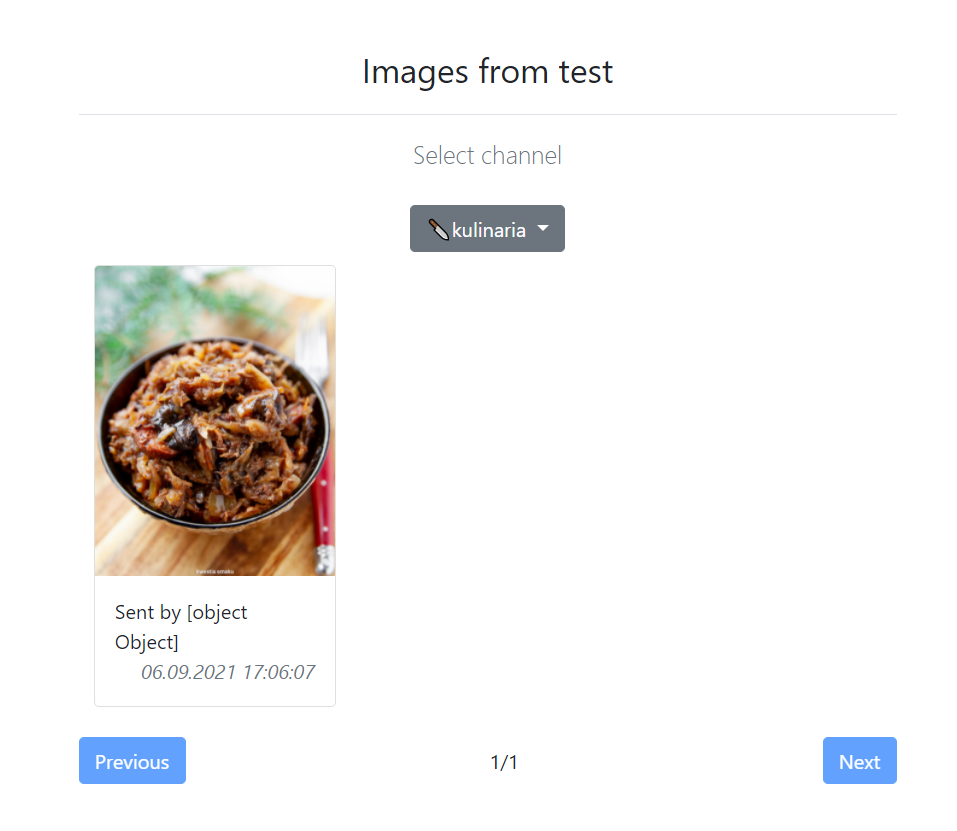

# Discord image viewer
Are you tired of scrolling to an image that someone send on the channel days ago? Here's a solution! Configure your server bot and browse sent images divided by channels.

### Example
You need configure your discord bot to use this application. You also need: Tomcat server for application hosing, SQL database to store image links and Rabbitmq to communicate with discord bot. Your bot needs to provide server authorization.
Here's Java Discord bot code as an example:
- [bean configuration(Rammitmq message converter)](https://github.com/Haseoo/maymer-the-discord-bot/blob/master/src/main/java/va/com/szkal/maymer/configuration/BeanConfiguration.java)
- [image message handler](https://github.com/Haseoo/maymer-the-discord-bot/blob/master/src/main/java/va/com/szkal/maymer/listeners/MaymerImagesListener.java)
- [package classes handling logic](https://github.com/Haseoo/maymer-the-discord-bot/tree/master/src/main/java/va/com/szkal/maymer/images)

